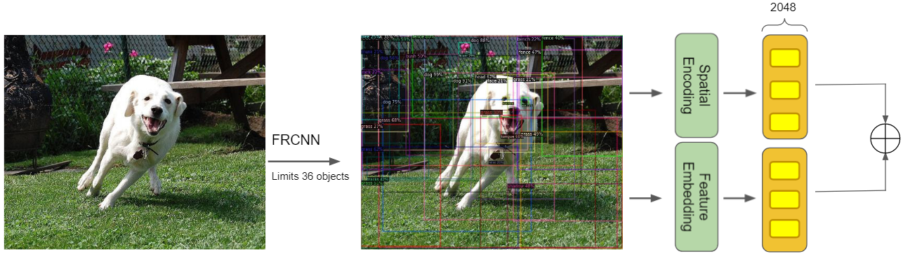

# Image Captioning with Transformer
This project applies Transformer-based model for Image captioning task. In this study project, most of the work are reimplemented, some are adapted with lots of modification. The purpose of this project is to test the performance of the Transformer architecture and Bottom-Up feature, I conduct experiment and compare two different ways to extract features from visual input (image) and encode it to a sequence.

The following figure gives an overview of the baseline model architectures.

<div align="center"></div>

There are 2 ways to embed visual inputs:
- In the patch-based architecture, image features can be extracted by split the image into patches (16x16), then flatten (same method as [Vision-Transformer](https://arxiv.org/abs/2010.11929)). Or extracted using a fixed grid tiles (8x8) follows an Inception V3 model.

| Patch-based Encoders |
|:-------------------------:|
| |
| |

- In the architecture which uses [bottom-up attention](https://arxiv.org/abs/1707.07998), FasterRCNN is used to extract features for each detected object in the image. This method captures visual meanings with object-aware semantics and generates some very good captions (in my opinion though).

| Bottom-Up Encoder |
|:-------------------------:|
| |

Vocabulary can be built in two ways:
- Use AutoTokenizer from Huggingface Transformer librabry
- From scratch (suggested if using small dataset)

Extract features and save as numpy array 
- To extract features from InceptionV3, use ```preprocess/grid/cnn/preprocess.py```
- To extract bottom-up features, I provide [Colab Notebook](https://colab.research.google.com/drive/1xC4mVc_bp0t4-7T4xVum3AECFCalsgsv?usp=sharing) which adapts code from [Detectron model](https://github.com/airsplay/py-bottom-up-attention)


## Datasets
I train both the patch-based and bottom-up models on Flickr30k dataset which contains 31,000 images collected from Flickr, together with 5 reference sentences provided by human annotators for each image. Download COCO-format [Flickr30k](https://drive.google.com/drive/folders/1Q2Yc13oViObHB20kXh8pKaaEb6xJxe5N?usp=sharing)
For COCO captioning data format, see [COCO format](https://cocodataset.org/#format-data)

## Results
The results shown here are recorded after training for 100 epochs, on validation split. Captions are generated by using Beam search with width of size 3. 
 
Model | Bleu_1 | Bleu_2 | Bleu_3 | Bleu_4 | METEOR | ROUGE_L | CIDEr | SPICE 
--- | --- | --- | --- | --- | --- | --- | --- | --- |
[Transformer (deit_tiny_distilled_patch16_224)](https://drive.google.com/file/d/1-VYNfi6BPz823rzjs0LEoqXEgDiWnDon/view?usp=sharing) | 0.61111 | 0.432 | 0.30164 | 0.21026 | 0.18603 | 0.44001 | 0.39589 | 0.1213
[Transformer (frcnn_bottomup_attention)](https://drive.google.com/file/d/1-h4rODxBeVpwlNL1dZQmV_PZH0R-0SW9/view?usp=sharing)| 0.61693 | 0.44336 | 0.31383 | 0.22263 | 0.2128 | 0.46285 | 0.4904 | 0.15042

| Images | Caption with beam size = 3 |
|:-------------------------:|:-------------------------:|
|  | **Bottom-up**: A man sits on a bench with a newspaper <br> **Patch-based (flatten)**: A man in a hat and a hat is sitting on a bench <br />|
|  | **Bottom-up**: A snow boarder in a red jacket is jumping in the air <br> **Patch-based (flatten)**: A snow boarder in a yellow shirt is jumping over a snowy hill <br />|
|  | **Bottom-up**: A man is sitting on a chair with a basket full of bread in front of him <br> **Patch-based (flatten)**: A woman is selling fruit at a market <br />|
|  | **Bottom-up**: A group of people are playing music in a dark room <br> **Patch-based (flatten)**: A man in a black shirt is standing in front of a large crowd of people <br />|
|  | **Bottom-up**: A man in a red uniform is riding a white horse <br> **Patch-based (flatten)**: A man in a red shirt and white pants is riding a white horse <br />|

## Paper References
Ideas from:
- [CPTR: FULL TRANSFORMER NETWORK FOR IMAGE CAPTIONING](https://arxiv.org/abs/2101.10804) (2021; Wei Liu, Sihan Chen et. al)
- [Bottom-Up and Top-Down Attention for Image Captioning](https://arxiv.org/abs/1707.07998) (2018; Peter Anderson et. al)

## Code References
- https://github.com/rwightman/pytorch-image-models/blob/master/timm/models/vision_transformer.py
- https://github.com/SamLynnEvans/Transformer
- https://nlp.seas.harvard.edu/2018/04/03/attention.html
- https://github.com/salaniz/pycocoevalcap
- https://huggingface.co/blog/how-to-generate
- https://github.com/krasserm/fairseq-image-captioning
- https://github.com/airsplay/py-bottom-up-attention
